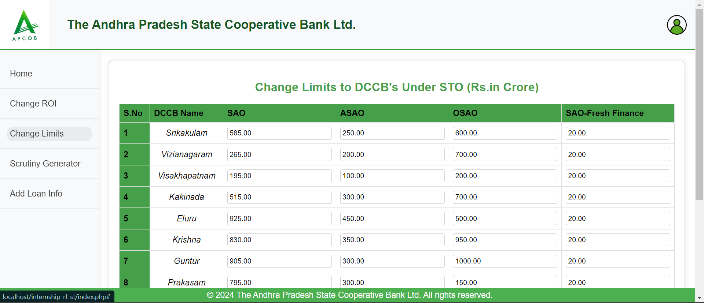

# Automated Scrutiny Generation and Loan Reset Management

## Project Overview

  

This web application was developed for the **Andhra Pradesh State Cooperative Bank Ltd (APCOB)** to streamline the scrutiny process for short-term loans. APCOB sanctions loans to **13 District Cooperative Central Banks (DCCBs)** at lower interest rates than market standards, relying on funding from **NABARD**. NABARD monitors APCOB's loan sanctioning process monthly, necessitating thorough verification through scrutiny notes.

**Previously, scrutiny notes were generated manually until August 3, 2024.** This application automates the generation of scrutiny notes, significantly enhancing efficiency for the ST department of APCOB. Additionally, it includes a loan reset management functionality, allowing interest rates to be adjusted based on market values every 91 days. This ensures compliance with regulations and optimizes loan servicing, contributing to a more robust financial management system.

## Features

### 1. Login Functionality
The application employs secure login mechanisms to ensure that only authorized users from APCOB can access and manage scrutiny notes.

  

The login page captures user credentials and authenticates them based on pre-configured roles, enhancing security and user management. This ensures that sensitive financial data remains protected and only accessible to those with appropriate permissions.

### 2. Change ROI (Rate of Interest) Management

  

One of the critical features is the **Change ROI** module. Here, users can manage loan interest rates based on market fluctuations. Rates can be adjusted daily and stored in the database. This module facilitates the efficient utilization of these rates while generating updated scrutiny notes, ensuring timely adjustments to loan conditions. Additionally, the system can send notifications to users regarding significant changes in ROI, enabling proactive financial management. Atlast daily ROI details can be dowloaded in excel format at profile dropdown.

### 3. Loan Management (Add, Modify Loans)

  

Users can easily **add loan details**. Loans are added here after generating loan account numbers from the bank portal. The system ensures that all loan records are stored in a structured format, making it easier to generate scrutiny notes. Authorized users can download loan details in the desired order at any time. The loan reset feature on the home page displays loans needing resets or loans already reset in the past week. This design helps avoid missing resets during holiday periods. Reset loans will be prioritized based on sequence, with date and time of the last reset displayed for better identification. Currently, this part of resetting loans is in the development stage, pending necessary security measures from the IT department. Future enhancements will also include the ability to track loan payment statuses, adding further clarity to loan management.

### 4. Change Limits for DCCBs

  

The **Change Limits** module allows the ST Department to update the borrowing limits for DCCBs. These limits determine how much each DCCB can borrow from APCOB under short-term loans. The feature ensures that loan limits are up-to-date and reflect the latest financial agreements. Limits are fixed for one year, but based on ratings, some DCCBs may see increased limits, enabling users to adjust borrowing capacities as needed. Enhanced analytics can also be incorporated in the future to better evaluate the impact of these limits on loan distributions.

### 5. Automated Scrutiny Note Generation

  

The **Scrutiny Generator** is the heart of this application. It automates the generation of scrutiny notes for short-term loans, such as **SAO**, **ASAO**, and **STO** loans. These scrutiny notes ensure that loan documentation complies with APCOB and NABARD's strict monitoring and auditing requirements. The scrutiny notes are created from templates provided by APCOB. The **DOCxtemplater.js** library was utilized for document automation, streamlining the process of generating scrutiny documents. Users can also view a history of generated scrutiny notes, improving transparency and traceability within the process.

### 6. SAO, ASAO, and STO Loan Scrutiny

  

  

  

The application supports scrutiny for various loan types, including **SAO (Short-Term Agricultural Operations)**, **ASAO (Additional Short-Term Agricultural Operations)**, and **STO (Short-Term Operations)**. This modular approach allows the department to generate scrutiny notes specific to the type of loan being audited. The scrutiny generation pages for SAO, ASAO, and STO are dynamically adjusted based on user input. AJAX requests with PHP were employed to retrieve information about limits and ROIs without needing to reload the webpage. If a DCCB does not qualify for sufficient amounts based on various parameters for their requested amount, a warning is displayed, showing the remaining balance that can be secured as a loan. This webpage was developed based on user requests and is designed to support future enhancements in the scrutiny generation process.

## Technical Details

### 1. Technology Stack
- **Frontend**: HTML, CSS, JavaScript
- **Backend**: PHP, MySQL
- **Database**: MySQL via PHPMyAdmin for storing loan data, limits, and scrutiny notes.
- **Other Libraries/Frameworks**: Used **docxtemplater.js** for document generation, enabling the application to create Word documents for scrutiny notes.

### 2. Loan Reset Management

  

Every 91 days, interest rates for loans are reviewed and adjusted according to the current market rates. This **Loan Reset Management** feature ensures that all interest adjustments are automatically reflected in the scrutiny notes, reducing manual errors and improving operational efficiency. The automated notifications alert users to any upcoming resets, further enhancing compliance and oversight. At last daily Loan details can be dowloaded in excel format in the given sequence at first sorted by purposes under profile dropdown.

### 3. Database Structure
The application uses a relational database to manage loan information, reset dates, user data, and scrutiny note history. This structured approach enables easy retrieval and updates for loans and associated details.

## Future Enhancements
- **Loan Repayment Management**: Currently, the project focuses on loan scrutiny and resets. Future versions will include features for loan repayment tracking and management.
- **Enhanced Reporting**: Expand the reporting capabilities to include graphical representations of loan data and repayment schedules.
- **User Roles and Permissions**: Add more granular user roles to control access to specific features and ensure data integrity.

### 4. Workflow Diagram

  

Like this, after login, home, Scrutiny generator, update Daily ROI, update Limits, and Add Loan Details options are available, and their respective features are shown in the above diagram.

## Conclusion
This project has automated a previously manual process at APCOB, significantly improving the efficiency and accuracy of scrutiny note generation. It offers a robust loan reset management system, dynamic scrutiny generation, and easy-to-use interfaces for managing loans and limits for DCCBs. By utilizing modern web technologies and best practices, this application positions APCOB for future growth and enhanced service delivery in financial management.
