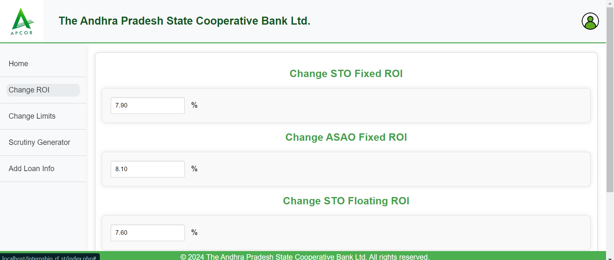

# Automated Scrutiny Generation and Loan Reset Management

## Project Overview

  

This web application was developed for the **Andhra Pradesh State Cooperative Bank Ltd (APCOB)** to streamline the scrutiny process for short-term loans. APCOB sanctions loans to **13 District Cooperative Central Banks (DCCBs)** at lower interest rates than market standards, relying on funding from **NABARD**. NABARD monitors APCOB's loan sanctioning process monthly, necessitating thorough verification through scrutiny notes.

**Previously, scrutiny notes were generated manually until August 3, 2024.** This application automates the generation of scrutiny notes, enhancing efficiency for the ST department of APCOB. Additionally, it includes loan reset management functionality, allowing interest rates to be adjusted based on market values every 91 days, ensuring compliance and optimizing loan servicing.

## Features

### 1. Login Functionality
The application uses secure login mechanisms to ensure that only authorized users from APCOB can access and manage scrutiny notes.

  

The login page captures user credentials and authenticates them based on pre-configured roles for security purposes.

### 2. Change ROI (Rate of Interest) Management

  

One of the critical features is the **Change ROI** module. Here, users can manage loan interest rates based on market fluctuations. Rates can be changed every day and can be stored in the database, and this module helps in efficiently using these rates while generating the updated scrutiny notes.

### 3. Loan Management (Add, Modify Loans)

  

Users can easily **add loan details**. Loans are added here after generating loans account number from the bank portal. The system ensures that all loan records are stored in a structured format, making it easier to generate scrutiny notes. at last loan details can be downloaded in the desired order at any time by the authorised user. Loan reset can be done in the home page where loans are displayed which are needed to reset or already reseted loans from last 1 week so that to avoid the holiday time missing reset. reseted loans in the home page will be thrown down of sequence and date and time of last reset is also shown for better identification of loans by user. This part of resetting loans is still in developing stage after meeting required security measures(checked by IT department) this part of resetting loans will be used correctly, But now scrtiny generation feature was used by APCOB except for this reset loans feature.

### 4. Change Limits for DCCBs

  

The **Change Limits** module allows the ST Department to update the borrowing limits for DCCBs. These limits determine how much each DCCB can borrow from APCOB under short-term loans. The feature ensures that loan limits are up-to-date and reflect the latest financial agreements. These limits are fixed for one year. for some DCCB's based on rating these limits are increased, At that time user can use this feature.

### 5. Automated Scrutiny Note Generation

  

The **Scrutiny Generator** is the heart of this application. It automates the generation of scrutiny notes for short-term loans, such as **SAO**, **ASAO**, and **STO** loans. These scrutiny notes ensure that loan documentation complies with APCOB and NABARD's strict monitoring and auditing requirements. These Scrutinies are created from templates given by APCOB. I had used DOCxtemplater.JS library for document automation. 

### 6. SAO, ASAO, and STO Loan Scrutiny

  

  

  

The application supports scrutiny for various loan types, including **SAO (Short-Term Agricultural Operations)**, **ASAO (Additional Short-Term Agricultural Operations)**, and **STO (Short-Term Operations)**. This modular approach allows the department to generate scrutiny notes specific to the type of loan being audited. This Scrutiny generation pags of SAO, ASAO, STO are dynamically adjusted based on user input. To get the info of limits and roi's I had used AJAX requests with PHP which helped me to get the info display in the webpage without reloading the webpage. while generating scrutiny if the respected DCCB is not get the suuficient amount based on various paramters for their requested amount remaing abalance which they can be get as loan is displayed by showing a small warning. This webpage was developed based on user requests and completely supports the future changes of this scrutiny generation process.

## Technical Details

### 1. Technology Stack
- **Frontend**: HTML, CSS, JavaScript
- **Backend**: PHP, MySQL
- **Database**: MySQL via PHPMyadmin for storing loan data, limits, and scrutiny notes.
- **Other Libraries/Frameworks**: Used docxtemplater.js for document generation, enabling the application to create Word documents for scrutiny notes.

### 2. Loan Reset Management

  

Every 91 days, interest rates for loans are reviewed and adjusted according to the current market rates. This **Loan Reset Management** feature ensures that all interest adjustments are automatically reflected in the scrutiny notes, reducing manual errors and improving efficiency.

### 3. Database Structure

The application uses a relational database to manage loan information, reset dates, user data, and scrutiny note history. This structure enables easy retrieval and updates for loans and associated details.

## Future Enhancements
- **Loan Repayment Management**: Currently, the project focuses on loan scrutiny and resets. In future versions, the project can include loan repayment tracking and management.
- **Enhanced Reporting**: Expand the reporting capabilities to include graphical representations of loan data and repayment schedules.
- **User Roles and Permissions**: Add more granular user roles to control access to specific features.

## Conclusion
This project has automated a previously manual process at APCOB, improving both the efficiency and accuracy of scrutiny note generation. It offers a robust loan reset management system, dynamic scrutiny generation, and easy-to-use interfaces for managing loans and limits for DCCBs.
